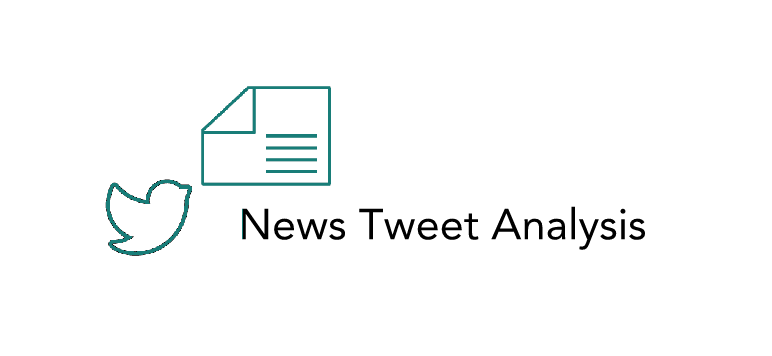

# News Tweet Analysis

View the Jupyter Notebook easily by copying [this link](https://github.com/pinkdragon1000/News-Tweet-Analysis/blob/master/News%20Tweet%20Analysis.ipynb) and pasting it into [here](https://nbviewer.jupyter.org/).

**Project Goals**

* What part of the day was the most/least tweets posted?
* What utilities are most commonly used to post tweets?
* Who are the top posters that use #news on May 25th.
* What news topics go under the categories of positive, negative, and neutral sentiments?
* What news topics do people talk about most?

[Link to Slides](https://docs.google.com/presentation/d/1BMiOZXUHh9V0ZDekYLhY0mWsuZlnCJb-HdCFhPrzwPs/edit#slide=id.g589d691f2b_0_51)
